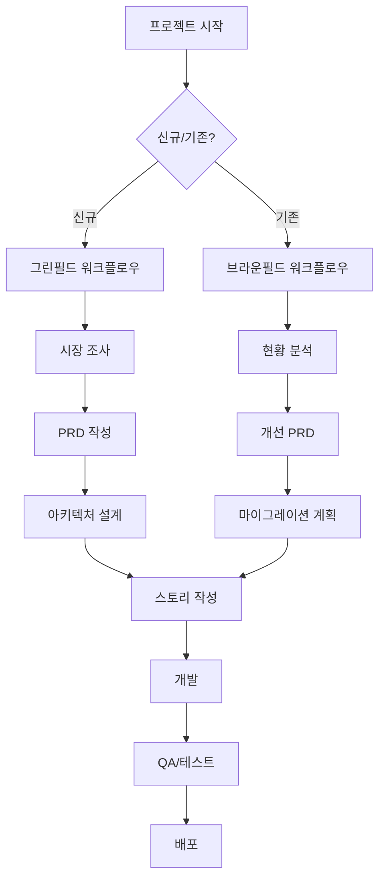

# BMAD 메소드 한글 버전 사용자 가이드

> 이 가이드는 BMAD 메소드 한글 버전(v1.0.0)의 완전한 사용법을 설명합니다. 원본 BMAD v4.35.3의 모든 기능을 포함합니다.

## 목차

1. [소개](#소개)
2. [설치 및 설정](#설치-및-설정)
3. [핵심 개념](#핵심-개념)
4. [워크플로우](#워크플로우)
5. [에이전트 가이드](#에이전트-가이드)
6. [명령어 참조](#명령어-참조)
7. [모범 사례](#모범-사례)
8. [문제 해결](#문제-해결)

## 소개

BMAD(BMad-Method)는 AI 기반의 애자일 개발 방법론으로, 17개의 전문화된 AI 에이전트가 프로젝트의 전체 라이프사이클을 지원합니다.

### 주요 특징

- **전문화된 에이전트**: 각 역할별 전문 AI 에이전트
- **체계적 워크플로우**: 계획부터 배포까지 단계별 프로세스
- **문서 중심 접근**: 자동화된 문서 생성 및 관리
- **품질 보증 내장**: 체크리스트와 검증 프로세스

## 설치 및 설정

### 1. 글로벌 설치

```bash
npm install -g bmad-method-korean
```

### 2. 프로젝트 설정

```bash
# 새 프로젝트
mkdir my-project && cd my-project
bmad-korean init

# 기존 프로젝트
cd existing-project
bmad-korean install
```

### 3. 설정 확인

```bash
# 설치 확인
ls -la .bmad-core/

# 에이전트 목록 확인
bmad-korean list-agents
```

## 핵심 개념

### 에이전트 (Agents)

각 에이전트는 특정 역할과 전문성을 가진 AI 페르소나입니다:

- **제품관리자(PM)**: 제품 전략과 요구사항 정의
- **아키텍트**: 시스템 설계와 기술 결정
- **개발자**: 코드 구현과 테스트
- **QA**: 품질 검증과 코드 리뷰

### 작업 (Tasks)

작업은 에이전트가 수행하는 구체적인 활동입니다:

- `문서생성`: 템플릿 기반 문서 작성
- `스토리생성`: 사용자 스토리 작성
- `체크리스트실행`: 품질 검증

### 템플릿 (Templates)

구조화된 문서를 생성하기 위한 YAML 기반 템플릿:

- PRD 템플릿
- 아키텍처 템플릿
- 스토리 템플릿

## 워크플로우

### 전체 프로젝트 워크플로우



### 계획 단계 (웹 UI 또는 강력한 IDE)

1. **시장 조사** (선택사항)
   ```
   @분석가 [제품 아이디어]에 대한 시장 조사를 수행해줘
   ```

2. **PRD 작성**
   ```
   @제품관리자 PRD를 작성해줘
   ```

3. **UX 설계** (UI가 있는 경우)
   ```
   @UX전문가 사용자 인터페이스를 설계해줘
   ```

4. **아키텍처 설계**
   ```
   @아키텍트 시스템 아키텍처를 설계해줘
   ```

5. **문서 검증**
   ```
   @제품소유자 모든 문서를 검토하고 정렬해줘
   ```

### 개발 단계 (IDE)

1. **문서 분할**
   ```
   @제품소유자 PRD와 아키텍처를 분할해줘
   ```

2. **스토리 작성**
   ```
   @스크럼마스터 다음 스토리를 작성해줘
   ```

3. **개발**
   ```
   @개발자 스토리를 구현해줘
   ```

4. **품질 검증**
   ```
   @품질보증 구현된 코드를 리뷰해줘
   ```

## 에이전트 가이드

### 제품관리자 (PM)

**역할**: 제품 전략, 요구사항 정의, 로드맵 계획

**주요 명령어**:
- `*create-prd`: PRD 생성
- `*create-epic`: 에픽 생성
- `*create-story`: 스토리 생성
- `*shard-prd`: PRD 분할

**사용 예시**:
```
@제품관리자 온라인 쇼핑몰을 위한 PRD를 작성해줘
> *create-prd
> [대화형 PRD 작성 프로세스 시작]
```

### 아키텍트

**역할**: 시스템 설계, 기술 스택 선택, 인프라 계획

**주요 명령어**:
- `*create-full-stack-architecture`: 풀스택 아키텍처 생성
- `*create-backend-architecture`: 백엔드 아키텍처 생성
- `*create-front-end-architecture`: 프런트엔드 아키텍처 생성
- `*document-project`: 프로젝트 문서화

**사용 예시**:
```
@아키텍트 마이크로서비스 기반 풀스택 아키텍처를 설계해줘
> *create-full-stack-architecture
> [기술 스택 및 설계 결정 프로세스]
```

### 개발자

**역할**: 코드 구현, 테스트 작성, 디버깅

**주요 명령어**:
- `*develop-story`: 스토리 개발
- `*run-tests`: 테스트 실행
- `*explain`: 구현 설명

**사용 예시**:
```
@개발자 사용자 인증 스토리를 구현해줘
> 스토리 파일을 로드하고 순차적으로 작업을 수행합니다...
> [코드 구현 및 테스트 작성]
```

### 품질보증 (QA)

**역할**: 코드 리뷰, 품질 검증, 리팩토링 제안

**주요 명령어**:
- `*review-code`: 코드 리뷰
- `*run-checklist`: 체크리스트 실행
- `*suggest-improvements`: 개선사항 제안

**사용 예시**:
```
@품질보증 방금 구현된 인증 모듈을 리뷰해줘
> [코드 분석 및 개선사항 제안]
```

## 명령어 참조

### 공통 명령어

모든 에이전트가 지원하는 명령어:

- `*help`: 사용 가능한 명령어 목록
- `*exit`: 에이전트 종료
- `*yolo`: YOLO 모드 전환 (빠른 실행)

### 에이전트별 명령어

#### 제품관리자
```
*create-prd                 - PRD 생성
*create-brownfield-prd      - 브라운필드 PRD 생성
*create-epic               - 에픽 생성
*create-story              - 스토리 생성
*shard-prd                 - PRD 분할
*correct-course            - 과정 수정
```

#### 아키텍트
```
*create-full-stack-architecture  - 풀스택 아키텍처
*create-backend-architecture     - 백엔드 아키텍처
*create-front-end-architecture   - 프런트엔드 아키텍처
*document-project               - 프로젝트 문서화
*execute-checklist              - 체크리스트 실행
*research {topic}               - 기술 연구
```

#### 개발자
```
*develop-story     - 스토리 개발
*run-tests        - 테스트 실행
*explain          - 구현 설명
```

#### 스크럼마스터
```
*create-next-story      - 다음 스토리 생성
*review-stories        - 스토리 검토
*plan-sprint          - 스프린트 계획
```

## 모범 사례

### 1. 체계적인 문서화

- 항상 PRD부터 시작
- 아키텍처 결정을 문서화
- 스토리에 명확한 승인 기준 포함

### 2. 점진적 개발

- 작은 스토리로 분할
- 각 스토리마다 테스트 포함
- 정기적인 코드 리뷰

### 3. 품질 우선

- 모든 주요 결정점에서 체크리스트 실행
- QA 리뷰를 개발 프로세스에 통합
- 자동화된 테스트 우선순위

### 4. 효율적인 에이전트 사용

```bash
# YOLO 모드로 빠른 실행
@제품관리자 *yolo 모드로 PRD 생성해줘

# 특정 템플릿 사용
@아키텍트 마이크로서비스 템플릿으로 아키텍처 생성해줘

# 체크리스트 자동 실행
@품질보증 전체 체크리스트를 실행해줘
```

## 문제 해결

### 일반적인 문제

**1. 에이전트가 응답하지 않음**
```bash
# 에이전트 재시작
@에이전트명 *exit
@에이전트명 [새 명령]
```

**2. 파일을 찾을 수 없음**
```bash
# 파일 경로 확인
ls -la .bmad-core/
# 필요시 재설치
bmad-korean repair
```

**3. 명령어가 작동하지 않음**
```bash
# 도움말 확인
@에이전트명 *help
# 명령어 형식 확인
```

### 고급 문제 해결

**컨텍스트 관리**
- 큰 프로젝트는 작은 단위로 분할
- 정기적으로 컨텍스트 정리
- 필요한 파일만 로드

**성능 최적화**
- YOLO 모드 활용
- 병렬 작업 처리
- 캐싱 활용

## 추가 리소스

- 📚 [브라운필드 가이드](./브라운필드에서작업하기.md)
- 🚀 [IDE 워크플로우](./향상된IDE개발워크플로우.md)
- 🤖 [에이전트 커스터마이징](../docs/에이전트커스터마이징.md)
- 💡 [팁과 트릭](../docs/팁과트릭.md)

## 지원 및 커뮤니티

- 💬 **Discord**: [discord.gg/gk8jAdXWmj](https://discord.gg/gk8jAdXWmj)
- 📧 **이메일**: bmad.korean@gmail.com
- 🐛 **이슈**: [GitHub Issues](https://github.com/bmad-korean/bmad-method-korean/issues)

---

이 가이드는 지속적으로 업데이트됩니다. 최신 버전은 [GitHub](https://github.com/bmad-korean/bmad-method-korean)에서 확인하세요.
