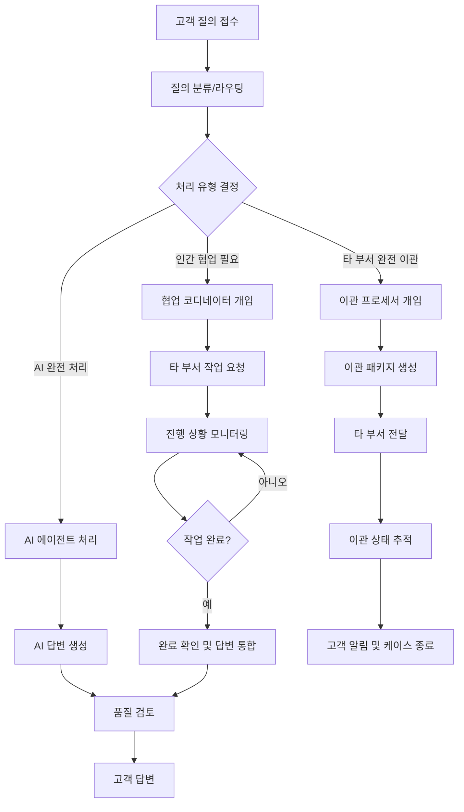

# BMAD-CS 확장팩 개요

## 목적과 범위
- 목표: 고객 질의 처리 전 과정을 AI 에이전트와 인간 협업으로 표준화/자동화
- 핵심 결과물: 고객 답변, 외부 작업 요청서, 이관 패키지, 품질 검토 기록
- 케이스 유형: 일반, 복잡, 협업(타 부서 요청/추적), 완전 이관, 에스컬레이션
- 운영 기준: SLA/우선순위, 라우팅 규칙, 컴플라이언스, 톤 가이드

## 하이브리드 프로세스 맵

## 에이전트 역할
- CS 접수 담당자 `cs-intake`: 접수/분류, 라우팅, 에스컬레이션, 상태 업데이트
- 협업 코디네이터 `cs-collaboration-coordinator`: 타 부서 작업 요청/추적/완료 확인/답변 통합/지연 에스컬레이션
- 이관 프로세서 `cs-handoff-processor`: 이관 적격성 판단, 이관 패키지 작성, 전환 조정, 고객 안내, 사후 추적
- 처리 담당자 `cs-processor`: 내부 처리 원칙에 따른 업무 수행, 답변 초안 작성
- 품질 관리자 `cs-quality`: 정확성/완전성/톤/컴플라이언스 검토, 승인
- (옵션) CS 매니저 `cs-manager`: 용량/우선순위/리포트, KPI 관리
- (옵션) 고객경험 전문가 `cs-experience`: 톤/템플릿 품질 개선, 매크로 관리

## 주요 워크플로우
- 일반 문의 `cs-general-inquiry`: 접수 → 처리 → 품질 → 답변
- 협업 처리 `cs-collaboration-workflow`: 요청 → 추적(반복) → 완료 검증 → 답변 통합 → 품질 → 답변
- 완전 이관 `cs-handoff-workflow`: 적격성 → 패키지 → 전환 → 고객 안내 → 사후 추적
- 에스컬레이션 `cs-escalation`: SLA 위반/리스크 조건 기반 알림 및 승급 경로
- 복잡 케이스 `cs-complex-case`: 정책 해석/다부서 조정 포함

## 템플릿(예시)
- 접수 기록 `inquiry-record-tmpl.yaml`
- 답변 템플릿 `response-template-tmpl.yaml` (브랜드 톤/금칙어 포함)
- 외부 작업 요청서 `external-work-request-tmpl.yaml`
- 이관 패키지 `handoff-package-tmpl.yaml` (컨텍스트, 타임라인, 연락처)
- 품질 검토 `quality-review-tmpl.yaml`, 고객 만족도 `customer-satisfaction-tmpl.yaml`, 케이스 종료 `case-closure-tmpl.yaml`

## 체크리스트(예시)
- 접수 체크리스트: 분류/라우팅/PII 마스킹
- 품질 체크리스트: 정확성/완전성/톤/컴플라이언스
- 이관 체크리스트: 컨텍스트/첨부/수신확인/고객 공지
- 에스컬레이션 체크리스트: 조건/레벨/알림/해제 기준

## 도메인 데이터/정책
- `policies.md`: 내부 처리 원칙/규제
- `routing-rules.yaml`: 유형→담당/부서/우선순위 규칙
- `sla-matrix.md`: 우선순위별 처리 기준
- `tone-guide.md`: 브랜드 톤/금칙어
- `departments.yaml`: 부서/역할/연락/가용시간
- `macro-library.md`: FAQ/매크로/스니펫

## 거버넌스/보안
- PII 처리/마스킹/보존 정책, 감사 로그, 이관 승인 흐름
- 역할 기반 접근제어(RBAC), 알림/에스컬레이션 규칙

## 성공 지표(KPI)
- FCR, 평균 TTR, CSAT, 재오픈율, SLA 준수율, 협업/이관 리드타임

## 다음 단계(권장 순서)
1) 스코프·운영 기준 확정 → 2) 리소스 스캐폴딩 → 3) 에이전트/작업 설계 → 4) 워크플로우 정의 → 5) 템플릿/체크리스트/데이터 구축 → 6) 거버넌스 설정 → 7) 파일럿 테스트 및 개선
